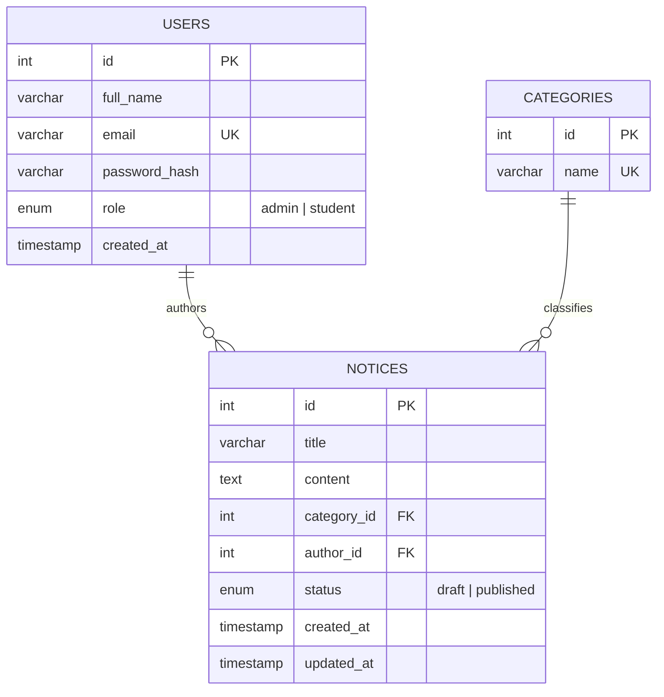

# Entity Relationship Diagram

```mermaid
erDiagram
    USERS ||--o{ NOTICES : "authors"
    CATEGORIES ||--o{ NOTICES : "classifies"

    USERS {
        int id PK
        varchar full_name
        varchar email UK
        varchar password_hash
        enum role "admin | student"
        timestamp created_at
    }
    CATEGORIES {
        int id PK
        varchar name UK
    }
    NOTICES {
        int id PK
        varchar title
        text content
        int category_id FK
        int author_id FK
        enum status "draft | published"
        timestamp created_at
        timestamp updated_at
    }
```

The full schema and sample data are in `ueab_smart_noticeboard.sql`.
