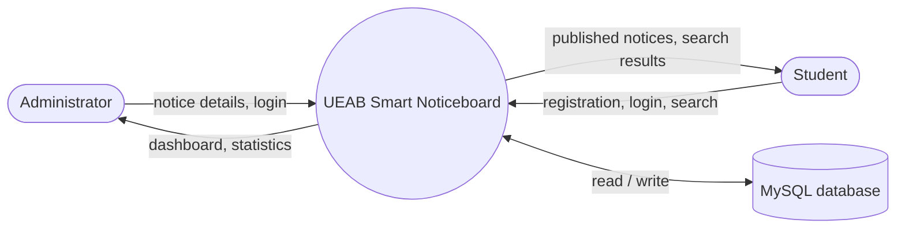

# Data Flow Diagram (Level 0)

```mermaid
flowchart LR
    A([Administrator]) -- "notice details, login" --> P((UEAB Smart Noticeboard))
    S([Student]) -- "registration, login, search" --> P
    P -- "dashboard, statistics" --> A
    P -- "published notices, search results" --> S
    P <-- "read / write" --> D[(MySQL database)]
```
